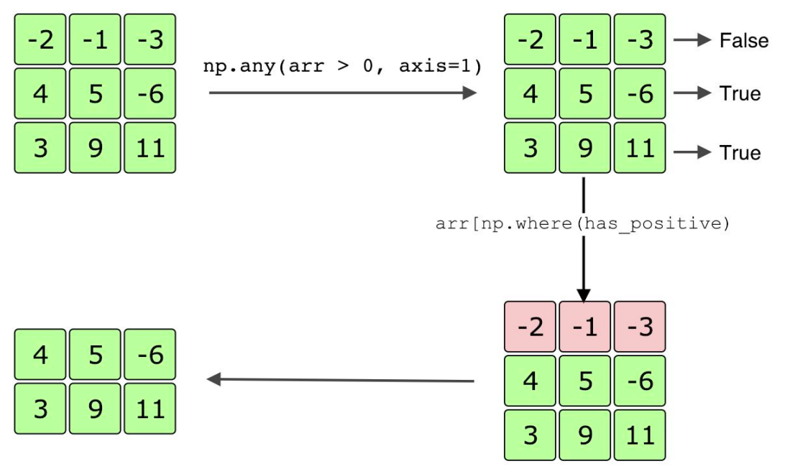

# Học máy với Python

## Tổng quan

Nếu bạn là kỹ sư phần mềm đang muốn bổ sung khả năng học máy vào bộ kỹ năng của mình thì đây là nơi để bắt đầu.

Khóa học này sẽ dạy bạn viết mã hữu ích và tạo các ứng dụng máy học có tác động ngay lập tức. Ngay từ đầu, bạn sẽ được cung cấp tất cả các công cụ cần thiết để tạo các dự án machine learning cấp ngành. Thay vì đọc qua lý thuyết dày đặc, bạn sẽ học các kỹ năng thực tế và đạt được những hiểu biết sâu sắc có thể áp dụng được. Các chủ đề được đề cập bao gồm phân tích/trực quan hóa dữ liệu, kỹ thuật tính năng, học có giám sát, học không giám sát và học sâu. Tất cả các chủ đề này đều được dạy bằng các khung tiêu chuẩn ngành: NumPy, pandas, scikit-learn, XGBoost, TensorFlow và Keras.

Kiến thức cơ bản về Python là điều kiện tiên quyết cho khóa học này.

### Học máy là gì?

Học máy (ML - Machine Learning) là nhánh khoa học liên quan đến các thuật toán và hệ thống thực hiện các nhiệm vụ cụ thể bằng cách sử dụng các mẫu và suy luận, thay vì các hướng dẫn được lập trình rõ ràng. Có nhiều trường hợp sử dụng khác nhau cho học máy, từ nhận dạng hình ảnh đến tạo văn bản. Hầu hết các nhiệm vụ học máy đều khái quát hóa thành một trong hai loại học tập sau:

- **Học có giám sát:** Sử dụng dữ liệu được dán nhãn để huấn luyện mô hình. Các nhãn cho tập dữ liệu huấn luyện thể hiện lớp/danh mục mà mỗi quan sát dữ liệu thuộc về. Sau khi đào tạo, mô hình sẽ có thể dự đoán nhãn cho các quan sát dữ liệu mới (từ cùng phân bố dân số với dữ liệu huấn luyện).
  - Ví dụ: Giả sử bạn đang huấn luyện một mô hình học máy để dự đoán liệu một bức ảnh có chứa hồ hay không. Với học có giám sát, bạn sẽ huấn luyện một mô hình trên một tập dữ liệu gồm các ảnh trong đó nhãn cho mỗi ảnh là “Có” nếu nó chứa hồ hoặc “Không” nếu không có hồ. Sau khi đào tạo, mô hình sẽ có thể chụp ảnh và xác định xem nó có chứa hồ hay không.
- **Học không giám sát:** Sử dụng dữ liệu không được gắn nhãn để cho phép mô hình tìm hiểu mối quan hệ giữa các quan sát dữ liệu và chọn ra các mẫu cơ bản. Hầu hết dữ liệu trên thế giới đều không được gắn nhãn, điều này khiến cho việc học không giám sát trở thành một phương pháp học máy rất hữu ích.
  - Ví dụ: Quay lại tập dữ liệu hình ảnh tương tự ở trên, nhưng bây giờ giả sử tập dữ liệu huấn luyện không được gắn nhãn. Sử dụng phương pháp học không giám sát, một mô hình sẽ có thể nhận ra sự khác biệt vốn có giữa ảnh có hồ và ảnh không có hồ, ví dụ: sự khác biệt về màu sắc hoặc hướng pixel. Điều này cho phép mô hình phân cụm các hình ảnh thành hai nhóm riêng biệt.

Nếu có thể có được các tập dữ liệu huấn luyện được gắn nhãn đủ lớn thì học có giám sát là cách tốt nhất. Tuy nhiên, thường rất khó để có được các bộ dữ liệu được dán nhãn đầy đủ, đó là lý do tại sao nhiều nhiệm vụ yêu cầu học không giám sát hoặc học bán giám sát (sự kết hợp giữa học có giám sát và không giám sát). Quyết định sử dụng loại phương pháp học nào chỉ là bước đầu tiên để tạo ra mô hình học máy. Bạn cũng cần chọn kiến ​​trúc mô hình phù hợp cho nhiệm vụ của mình và quan trọng nhất là có thể xử lý dữ liệu thành quy trình đào tạo và diễn giải/phân tích kết quả mô hình.

### Machine Learning vs Artificial Intelligence vs Data Science

Mọi người thường sử dụng các thuật ngữ “học máy”, “trí tuệ nhân tạo” và “khoa học dữ liệu” thay thế cho nhau. Trên thực tế, học máy là một tập hợp con của trí tuệ nhân tạo (AI) và có mối liên hệ chặt chẽ với khoa học dữ liệu. Trí tuệ nhân tạo xử lý bất kỳ kỹ thuật nào cho phép máy móc hiển thị “trí thông minh”, tương tự như con người. Học máy là một trong những kỹ thuật chính được sử dụng để tạo ra trí tuệ nhân tạo, nhưng các kỹ thuật không phải ML khác (ví dụ: cắt tỉa alpha-beta, hệ thống dựa trên quy tắc) cũng được sử dụng rộng rãi trong AI.

Mặt khác, khoa học dữ liệu liên quan đến việc thu thập thông tin chi tiết từ bộ dữ liệu. Theo truyền thống, các nhà khoa học dữ liệu đã sử dụng các phương pháp thống kê để thu thập những hiểu biết này. Tuy nhiên, khi học máy tiếp tục phát triển, nó cũng đã thâm nhập vào lĩnh vực khoa học dữ liệu.

Trong ngành, bất kỳ nhà khoa học dữ liệu hoặc nhà nghiên cứu AI nào cũng cần có hiểu biết tốt về học máy. Học máy trong công nghiệp đã cho phép chúng ta tạo ra các hệ thống tự động tuyệt vời. Các hệ thống này đã đạt được hoặc thậm chí đôi khi vượt quá hiệu suất tốt nhất của con người trong các lĩnh vực tương ứng của chúng. Một ví dụ điển hình là AlphaGo, một hệ thống dựa trên máy học đã đánh bại những người chơi cờ vây giỏi nhất thế giới.

### 7 Bước của Quy trình Học Máy

1. **Thu thập dữ liệu:** Quá trình trích xuất các tập dữ liệu thô cho tác vụ học máy. Dữ liệu này có thể đến từ nhiều nơi khác nhau, từ các tài nguyên trực tuyến nguồn mở đến nguồn cung ứng cộng đồng có trả phí. Bước đầu tiên của quá trình học máy được cho là quan trọng nhất. Nếu dữ liệu bạn thu thập có chất lượng kém hoặc không liên quan thì mô hình bạn đào tạo cũng sẽ có chất lượng kém.
2. **Xử lý và chuẩn bị dữ liệu:** Sau khi thu thập dữ liệu liên quan, bạn cần xử lý dữ liệu đó và đảm bảo rằng dữ liệu đó ở định dạng có thể sử dụng được để đào tạo mô hình học máy. Điều này bao gồm xử lý dữ liệu bị thiếu, xử lý các dữ liệu ngoại lệ, v.v.
3. **Kỹ thuật tính năng:** Sau khi bạn đã thu thập và xử lý tập dữ liệu của mình, bạn có thể sẽ cần phải chuyển đổi một số tính năng (và đôi khi thậm chí loại bỏ một số tính năng) để tối ưu hóa mức độ đào tạo của mô hình về dữ liệu.
4. **Lựa chọn mô hình:** Dựa trên tập dữ liệu, bạn sẽ chọn kiến ​​trúc mô hình nào sẽ sử dụng. Đây là một trong những nhiệm vụ chính của kỹ sư công nghiệp. Thay vì cố gắng đưa ra một kiến ​​trúc mô hình hoàn toàn mới, hầu hết các nhiệm vụ có thể được thực hiện triệt để với kiến ​​trúc hiện có (hoặc kết hợp các kiến ​​trúc mô hình).
5. **Đường ống dữ liệu và đào tạo mô hình:** Sau khi chọn kiến ​​trúc mô hình, bạn sẽ tạo một đường ống dữ liệu để đào tạo mô hình. Điều này có nghĩa là tạo ra một luồng quan sát dữ liệu theo đợt liên tục để huấn luyện mô hình một cách hiệu quả. Vì quá trình đào tạo có thể mất nhiều thời gian nên bạn muốn đường dẫn dữ liệu của mình hiệu quả nhất có thể.
6. **Xác thực mô hình:** Sau khi đào tạo mô hình trong một khoảng thời gian vừa đủ, bạn sẽ cần xác thực hiệu suất của mô hình trên một phần được giữ lại của tập dữ liệu tổng thể. Dữ liệu này cần phải đến từ cùng một phân phối cơ bản như tập dữ liệu huấn luyện nhưng cần phải là dữ liệu khác mà mô hình chưa từng thấy trước đây.
7. **Tính bền vững của mô hình:** Cuối cùng, sau khi đào tạo và xác nhận hiệu suất của mô hình, bạn cần có khả năng lưu đúng trọng số của mô hình và có thể đưa mô hình vào sản xuất. Điều này có nghĩa là thiết lập một quy trình mà người dùng mới có thể dễ dàng sử dụng mô hình được đào tạo trước của bạn để đưa ra dự đoán.

Sau khi tham gia khóa học này, bạn sẽ có thể thực hiện quy trình và làm sạch tập dữ liệu thô, đào tạo mô hình học máy trên dữ liệu đó và xác thực hiệu suất của mô hình. Cụ thể, bạn sẽ có thể:

- **Lấy một tập dữ liệu thô và xử lý nó cho một nhiệm vụ nhất định.** Điều này có nghĩa là xử lý dữ liệu bị thiếu và các ngoại lệ, chuẩn hóa và chuyển đổi các tính năng, tìm ra tính năng nào phù hợp nhất với nhiệm vụ và chọn ra sự kết hợp tốt nhất của các tính năng để sử dụng.
- **Chọn kiến ​​trúc mô hình chính xác để sử dụng dựa trên dữ liệu.** Nhiều người sẽ luôn mặc định sử dụng mạng thần kinh lớn cho bất kỳ tác vụ học máy nào, nhưng nhiều khi điều này là không cần thiết và thậm chí có thể ảnh hưởng đến hiệu suất cuối cùng của mô hình nếu tập dữ liệu không đủ lớn.
- **Viết mã mô hình học máy và huấn luyện nó trên dữ liệu đã được xử lý.** Xác thực hiệu suất của mô hình trên dữ liệu được cung cấp và hiểu các kỹ thuật để cải thiện hiệu suất của mô hình.

## Thao tác dữ liệu với Numpy

### Giới thiệu

#### Xử lý dữ liệu

Khi được hỏi về mô hình thành công của Google, Peter Norvig, giám đốc nghiên cứu của Google, đã có câu nói nổi tiếng:

    “Chúng tôi không có thuật toán tốt hơn bất kỳ ai khác, chúng tôi chỉ có nhiều dữ liệu hơn mà thôi.” 

Mặc dù có thể là một cách đánh giá thấp (với số lượng nhân tài được tuyển dụng tại Google), nhưng câu trích dẫn này mang lại cảm giác về tầm quan trọng của dữ liệu để đạt được kết quả thành công.

Mọi người thường thảo luận về tầm quan trọng của dữ liệu trong bối cảnh học máy. Cho dù mô hình học máy phức tạp đến đâu, nó cũng sẽ không hoạt động tốt trừ khi có lượng dữ liệu hợp lý để đào tạo. Mặt khác, với một tập dữ liệu huấn luyện lớn và đa dạng, một mô hình học sâu tốt sẽ hoạt động tốt hơn đáng kể so với các thuật toán không học sâu.

Tuy nhiên, dữ liệu không chỉ giới hạn ở việc học máy. Các công ty sử dụng dữ liệu để xác định xu hướng khách hàng, các đảng chính trị sử dụng dữ liệu để xác định nhân khẩu học nào họ nên nhắm mục tiêu, các đội thể thao sử dụng dữ liệu để phân tích người chơi, v.v.

|                                                                                                                 |
| :-----------------------------------------------------------------------------------------------------------------------------------: |
| Dữ liệu ví dụ về bóng chày được sử dụng trong sabermetrics . Khái niệm này đã được phổ biến rộng rãi nhờ bộ phim Moneyball năm 2011 . |

Việc sử dụng dữ liệu phổ biến khiến cho việc xử lý dữ liệu , hành động chuyển đổi dữ liệu thô thành dạng có ý nghĩa, trở thành một kỹ năng cần thiết cần phải có.

#### NumPy

Nhiều kịch bản liên quan đến chủ yếu là các tập dữ liệu số. Ví dụ: dữ liệu y tế chứa nhiều số liệu, chẳng hạn như chiều cao, cân nặng và huyết áp. Hơn nữa, phần lớn các mạng thần kinh sử dụng dữ liệu đầu vào là số hoặc đã được chuyển đổi sang dạng số.

Khi chúng ta xử lý dữ liệu số, thư viện Python tốt nhất nên sử dụng là NumPy . Thư viện NumPy cho phép chúng ta thực hiện nhiều thao tác trên dữ liệu số và chuyển đổi dữ liệu sang các dạng dễ sử dụng hơn.

```python
import numpy as np  # import the NumPy library

# Initializing a NumPy array
arr = np.array([-1, 2, 5], dtype=np.float32)

# Print the representation of the array
print(repr(arr))
```

**Output:**

```output
array([-1.,  2.,  5.], dtype=float32)
```

### Mảng Numpy

#### Arrays

Mảng NumPy về cơ bản chỉ là danh sách Python với các tính năng bổ sung. Trên thực tế, bạn có thể dễ dàng chuyển đổi danh sách Python thành mảng Numpy bằng cách sử dụng hàm ***np.array*** lấy danh sách Python làm đối số bắt buộc. Hàm này cũng có khá nhiều đối số từ khóa, nhưng đối số chính cần biết là ***dtype***. Đối số từ khóa ***dtype*** lấy type NumPy và chuyển mảng theo cách thủ công sang type đã chỉ định.

Đoạn mã dưới đây là một ví dụ về cách sử dụng np.arrayđể tạo ma trận 2-D. Lưu ý rằng mảng được truyền thủ công tới ***np.float32.***

```python
import numpy as np

arr = np.array([[0, 1, 2], [3, 4, 5]],
               dtype=np.float32)
print(repr(arr))
```

**Output:**

```output
array([[0., 1., 2.],
       [3., 4., 5.]], dtype=float32)
```

Khi các phần tử của mảng NumPy là các kiểu hỗn hợp thì loại của mảng sẽ được nâng cấp lên loại cấp cao nhất. Điều này có nghĩa là nếu đầu vào mảng có hỗn hợp các phần tử int và float, tất cả các số nguyên sẽ được chuyển sang giá trị tương đương với dấu phẩy động của chúng. Nếu một mảng được trộn lẫn các phần tử int, float, và string, mọi thứ đều được chuyển thành chuỗi.

Mã dưới đây là một ví dụ về np.array upcasting. Cả hai số nguyên đều được chuyển sang dạng dấu phẩy động tương đương của chúng.

```python
arr = np.array([0, 0.1, 2])
print(repr(arr))
```

**Output:**

```output
array([0. , 0.1, 2. ])
```

#### Copying

Tương tự như danh sách Python, khi chúng ta tạo tham chiếu đến mảng NumPy, nó không tạo ra một mảng khác. Do đó, nếu chúng ta thay đổi một giá trị bằng biến tham chiếu, nó cũng sẽ thay đổi mảng ban đầu. Chúng ta giải quyết vấn đề này bằng cách sử dụng chức năng copy() vốn có của mảng Numpy. Hàm không có đối số bắt buộc và nó trả về mảng đã sao chép.

Trong ví dụ mã bên dưới, c là một tham chiếu đến a, trong khi d là một bản sao. Vì thế, việc thay đổi c dẫn đến sự thay đổi tương tự trong a, trong khi thay đổi d không làm thay đổi giá trị của b.

```python
a = np.array([0, 1])
b = np.array([9, 8])
c = a
print('Array a: {}'.format(repr(a)))
c[0] = 5
print('Array a: {}'.format(repr(a)))

d = b.copy()
d[0] = 6
print('Array b: {}'.format(repr(b)))
```

**Output:**

```output
Array a: array([0, 1])
Array a: array([5, 1])
Array b: array([9, 8])
```

#### Casting

Chúng ta ép kiểu mảng Numpy thông qua hàm astype() của nó. Đối số bắt buộc của hàm là kiểu mới cho mảng. Nó trả về mảng đã chuyển thành kiểu mới.

Mã bên dưới hiển thị một ví dụ về việc ép kiểu bằng cách sử dụng hàm astype(). Thuộc tính dtype trả về kiểu của mảng.

```python
arr = np.array([0, 1, 2])
print(arr.dtype)
arr = arr.astype(np.float32)
print(arr.dtype)
```

**Output:**

```output
int64
float32
```

#### NaN

Khi chúng ta không muốn mảng NumPy chứa một giá trị tại một chỉ mục cụ thể, chúng ta có thể sử dụng np.***nan*** để đóng vai trò giữ chỗ. Một cách sử dụng phổ biến cho ***np.nan*** là giá trị điền cho dữ liệu không đầy đủ.

Đoạn mã dưới đây cho thấy một ví dụ về cách sử dụng ***np.nan***. Lưu ý rằng ***np.nan*** không thể đảm nhận một loại số nguyên.

```python
arr = np.array([np.nan, 1, 2])
print(repr(arr))

arr = np.array([np.nan, 'abc'])
print(repr(arr))

# Will result in a ValueError: If we uncomment line 8 and run again.
#np.array([np.nan, 1, 2], dtype=np.int32)
np.array([np.nan, 1, 2], dtype=np.float32)
```

**Output:**

```output
array([nan,  1.,  2.])
array(['nan', 'abc'], dtype='<U32')
```

#### Infinity

Để biểu thị vô cực trong NumPy, chúng ta sử dụng giá trị đặc biệt ***np.inf***. Chúng ta cũng có thể biểu diễn âm vô cực bằng ***-np.inf***.

Đoạn mã dưới đây cho thấy một ví dụ về cách sử dụng ***np.inf***. Lưu ý rằng ***np.inf*** không thể đảm nhận một loại số nguyên.

```python
print(np.inf > 1000000)

arr = np.array([np.inf, 5])
print(repr(arr))

arr = np.array([-np.inf, 1])
print(repr(arr))

# Will result in a OverflowError: If we uncomment line 10 and run again.
# np.array([np.inf, 3], dtype=np.int32)
np.array([np.inf, 3], dtype=np.float32)
```

**Output:**

```output
True
array([inf,  5.])
array([-inf,   1.])
```

### Khái niệm cơ bản về Numpy

#### Ranged data

Trong khi ***np.array*** có thể được sử dụng để tạo bất kỳ mảng nào, nó tương đương với việc mã hóa cứng một mảng. Điều này sẽ không hoạt động khi mảng có hàng trăm giá trị. Thay vào đó, NumPy cung cấp tùy chọn để tạo mảng dữ liệu có phạm vi bằng cách sử dụng ***np.arange***. Chức năng này hoạt động rất giống với range trong Python và sẽ luôn trả về mảng 1-D.

Mã bên dưới chứa các ví dụ về cách sử dụng ***np.arange***.

```python
arr = np.arange(5)
print(repr(arr))

arr = np.arange(5.1)
print(repr(arr))

arr = np.arange(-1, 4)
print(repr(arr))

arr = np.arange(-1.5, 4, 2)
print(repr(arr))
```

**Output:**

```output
array([0, 1, 2, 3, 4])
array([0., 1., 2., 3., 4., 5.])
array([-1,  0,  1,  2,  3])
array([-1.5,  0.5,  2.5])
```

Đầu ra của ***np.arange*** được quy định như sau:

- Nếu chỉ có một số duy nhất, n, được truyền vào làm đối số, ***np.arange*** sẽ trả về một mảng có tất cả các số nguyên trong phạm vi [0, n).
- Đối với hai đối số, m và n, ***np.arange*** sẽ trả về một mảng có tất cả các số nguyên trong phạm vi [m, n).
- Đối với ba đối số, m, n và s, ***np.arange*** sẽ trả về một mảng có các số nguyên trong phạm vi [m, n) sử dụng kích thước bước nhảy là s .
- Giống ***np.array***, ***np.arange*** thực hiện upcasting. Nó cũng có đối số ***dtype*** để ép kiểu mảng theo cách thủ công.

Để chỉ định số phần tử trong mảng được trả về, thay vì kích thước bước, chúng ta có thể sử dụng hàm ***np.linspace***.

Hàm này nhận hai đối số đầu tiên bắt buộc, tương ứng cho phần đầu và phần cuối của phạm vi. Phần cuối của phạm vi bao gồm trong ***np.linspace***, trừ khi đối số ***endpoint*** được đặt thành False. Để chỉ định số phần tử, chúng ta đặt đối số num (giá trị mặc định của nó là 50).

Đoạn mã dưới đây cho thấy cách sử dụng ví dụ của ***np.linspace***. Nó cũng có đối số ***dtype*** để ép kiểu thủ công.

```python
arr = np.linspace(5, 11, num=4)
print(repr(arr))

arr = np.linspace(5, 11, num=4, endpoint=False)
print(repr(arr))

arr = np.linspace(5, 11, num=4, dtype=np.int32)
print(repr(arr))
```

**Output:**

```output
array([ 5.,  7.,  9., 11.])
array([5. , 6.5, 8. , 9.5])
array([ 5,  7,  9, 11], dtype=int32)
```

#### Reshaping data

Hàm chúng tôi sử dụng để định hình lại dữ liệu trong NumPy là ***np.reshape***. Nó lấy một mảng và một hình dạng mới làm đối số bắt buộc. Hình dạng mới phải chứa chính xác tất cả các phần tử từ mảng đầu vào. Ví dụ: chúng ta có thể định hình lại một mảng có 12 phần tử thành (4, 3), nhưng chúng ta không thể định hình lại nó thành (4, 4).

Chúng ta được phép sử dụng giá trị đặc biệt -1 cho nhiều nhất một chiều của hình dạng mới. Chiều có giá trị -1 sẽ nhận giá trị cần thiết để cho phép hình dạng mới chứa tất cả các phần tử của mảng.

Đoạn mã dưới đây cho thấy cách sử dụng ví dụ của np.reshape.

```python
arr = np.arange(8)

reshaped_arr = np.reshape(arr, (2, 4))
print(repr(reshaped_arr))
print('New shape: {}'.format(reshaped_arr.shape))

reshaped_arr = np.reshape(arr, (-1, 2, 2))
print(repr(reshaped_arr))
print('New shape: {}'.format(reshaped_arr.shape))
```

**Output:**

```output
array([[0, 1, 2, 3],
       [4, 5, 6, 7]])
New shape: (2, 4)
array([[[0, 1],
        [2, 3]],

       [[4, 5],
        [6, 7]]])
New shape: (2, 2, 2)
```

Trong khi ***np.reshape*** có thể thực hiện bất kỳ tiện ích định hình lại nào mà chúng ta cần, NumPy cung cấp một hàm vốn có để làm phẳng một mảng. Làm phẳng một mảng sẽ định hình lại nó thành mảng 1D. Vì chúng ta cần làm phẳng dữ liệu khá thường xuyên nên đây là một chức năng hữu ích.

Đoạn mã dưới đây làm phẳng một mảng bằng cách sử dụng hàm ***flatten***.

```python
arr = np.arange(8)
arr = np.reshape(arr, (2, 4))
flattened = arr.flatten()
print(repr(arr))
print('arr shape: {}'.format(arr.shape))
print(repr(flattened))
print('flattened shape: {}'.format(flattened.shape))
```

**Output:**

```output
array([[0, 1, 2, 3],
       [4, 5, 6, 7]])
arr shape: (2, 4)
array([0, 1, 2, 3, 4, 5, 6, 7])
flattened shape: (8,)
```

#### Transposing

Tương tự như cách người ta thường định hình lại dữ liệu, việc chuyển vị dữ liệu cũng rất phổ biến. Có lẽ chúng ta có dữ liệu lẽ ra phải ở một định dạng cụ thể, nhưng một số dữ liệu mới chúng ta nhận được đã được sắp xếp lại. Chúng ta chỉ có thể chuyển đổi dữ liệu bằng cách sử dụng hàm ***np.transpose***, để chuyển đổi nó sang định dạng thích hợp.

Đoạn mã dưới đây cho thấy một ví dụ về cách sử dụng hàm ***np.transpose***. Các hàng ma trận trở thành cột sau khi chuyển vị.

```python
arr = np.arange(8)
arr = np.reshape(arr, (4, 2))
transposed = np.transpose(arr)
print(repr(arr))
print('arr shape: {}'.format(arr.shape))
print(repr(transposed))
print('transposed shape: {}'.format(transposed.shape))
```

**Output:**

```output
array([[0, 1],
       [2, 3],
       [4, 5],
       [6, 7]])
arr shape: (4, 2)
array([[0, 2, 4, 6],
       [1, 3, 5, 7]])
transposed shape: (2, 4)
```

Hàm nhận một đối số đầu tiên bắt buộc, đây sẽ là mảng mà chúng ta muốn chuyển vị. Nó cũng có một đối số từ khóa duy nhất được gọi là ***axes***, đại diện cho hoán vị của kích thước.

Hoán vị là một bộ/danh sách các số nguyên, có cùng độ dài với số chiều trong mảng. Nó cho chúng ta biết nơi để thay đổi kích thước. Ví dụ: nếu hoán vị có 3 ở chỉ mục 1, điều đó có nghĩa là chiều thứ ba cũ của dữ liệu sẽ trở thành chiều thứ hai mới (vì chỉ mục 1 đại diện cho chiều thứ hai).

Đoạn mã dưới đây cho thấy một ví dụ về cách sử dụng ***np.transpose*** hoạt động với đối số từ khóa ***axes***. Thuộc tính ***shape*** cho biết hình dạng của mảng.

```python
arr = np.arange(24)
arr = np.reshape(arr, (3, 4, 2))
transposed = np.transpose(arr, axes=(1, 2, 0))
print('arr shape: {}'.format(arr.shape))
print('transposed shape: {}'.format(transposed.shape))
```

**Output:**

```output
arr shape: (3, 4, 2)
transposed shape: (4, 2, 3)
```

Trong ví dụ này, chiều thứ nhất cũ trở thành chiều thứ ba mới, chiều thứ hai cũ trở thành chiều thứ nhất mới và chiều thứ ba cũ trở thành chiều thứ hai mới. Giá trị mặc định cho ***axes*** là sự đảo ngược kích thước (ví dụ: đối với dữ liệu 3-D, mặc định ***axes*** giá trị là [2, 1, 0]).

#### Zeros and ones

Đôi khi, chúng ta cần tạo các mảng chỉ chứa 0 hoặc 1. Ví dụ: vì dữ liệu nhị phân được gắn nhãn 0 và 1, nên chúng ta có thể cần tạo các tập dữ liệu giả chỉ có một nhãn. Để tạo các mảng này, NumPy cung cấp các hàm ***np.zeros*** và ***np.ones***. Cả hai đều có cùng đối số, chỉ bao gồm một đối số bắt buộc, hình dạng mảng. Các chức năng này cũng cho phép ép kiểu thủ công bằng cách sử dụng đối số ***dtype***.

Đoạn mã dưới đây cho thấy cách sử dụng ví dụ của ***np.zeros*** và ***np.ones***.

```python
arr = np.zeros(4)
print(repr(arr))

arr = np.ones((2, 3))
print(repr(arr))

arr = np.ones((2, 3), dtype=np.int32)
print(repr(arr))
```

**Output:**

```output
array([0., 0., 0., 0.])
array([[1., 1., 1.],
       [1., 1., 1.]])
array([[1, 1, 1],
       [1, 1, 1]], dtype=int32)
```

Nếu chúng ta muốn tạo một mảng 0 hoặc 1 có hình dạng giống như mảng khác, chúng ta có thể sử dụng ***np.zeros_like*** và ***np.ones_like***.

Đoạn mã dưới đây cho thấy cách sử dụng ví dụ của ***np.zeros_like*** và ***np.ones_like***.

```python
arr = np.array([[1, 2], [3, 4]])
print(repr(np.zeros_like(arr)))

arr = np.array([[0., 1.], [1.2, 4.]])
print(repr(np.ones_like(arr)))
print(repr(np.ones_like(arr, dtype=np.int32)))
```

**Output:**

```output
array([[0, 0],
       [0, 0]])
array([[1., 1.],
       [1., 1.]])
array([[1, 1],
       [1, 1]], dtype=int32)
```

### Toán học

#### Số học

Một trong những mục đích chính của NumPy là thực hiện số học đa chiều. Sử dụng mảng NumPy, chúng ta có thể áp dụng số học cho từng phần tử chỉ bằng một thao tác.

Mã bên dưới hiển thị số học đa chiều với NumPy.

```python
arr = np.array([[1, 2], [3, 4]])
# Add 1 to element values
print(repr(arr + 1))
# Subtract element values by 1.2
print(repr(arr - 1.2))
# Double element values
print(repr(arr * 2))
# Halve element values
print(repr(arr / 2))
# Integer division (half)
print(repr(arr // 2))
# Square element values
print(repr(arr**2))
# Square root element values
print(repr(arr**0.5))
```

**Output:**

```output
array([[2, 3],
       [4, 5]])
array([[-0.2,  0.8],
       [ 1.8,  2.8]])
array([[2, 4],
       [6, 8]])
array([[0.5, 1. ],
       [1.5, 2. ]])
array([[0, 1],
       [1, 2]])
array([[ 1,  4],
       [ 9, 16]])
array([[1.        , 1.41421356],
       [1.73205081, 2.        ]])
```

Sử dụng số học NumPy, chúng ta có thể dễ dàng sửa đổi lượng lớn dữ liệu số chỉ bằng một vài thao tác. Ví dụ: chúng ta có thể chuyển đổi tập dữ liệu về nhiệt độ Fahrenheit sang dạng C tương đương của chúng.

Mã bên dưới chuyển đổi độ F sang độ C trong NumPy.

```python
def f2c(temps):
  return (5/9)*(temps-32)

fahrenheits = np.array([32, -4, 14, -40])
celsius = f2c(fahrenheits)
print('Celsius: {}'.format(repr(celsius)))
```

**Output:**

```output
Celsius: array([  0., -20., -10., -40.])
```

Điều quan trọng cần lưu ý là việc thực hiện số học trên mảng NumPy không làm thay đổi mảng ban đầu mà thay vào đó tạo ra một mảng mới là kết quả của phép toán số học.

#### Hàm phi tuyến tính

Ngoài các phép toán số học cơ bản, NumPy còn cho phép bạn sử dụng các hàm phi tuyến tính như hàm mũ và logarit.

Hàm ***np.exp*** thực hiện hàm mũ cơ số e trên một mảng, trong khi hàm ***np.exp2*** thực hiện hàm mũ cơ số 2. Tương tự như vậy, ***np.log***, ***np.log2***, Và ***np.log10*** tất cả đều thực hiện logarit trên một mảng đầu vào, sử dụng cơ số e, cơ số 2 và cơ số 10 tương ứng.

Mã bên dưới hiển thị các hàm mũ và logarit khác nhau với NumPy. Lưu ý rằng ***np.e*** Và ***np.pi*** lần lượt biểu thị các hằng số toán học e và π.

```python
arr = np.array([[1, 2], [3, 4]])
# Raised to power of e
print(repr(np.exp(arr)))
# Raised to power of 2
print(repr(np.exp2(arr)))

arr2 = np.array([[1, 10], [np.e, np.pi]])
# Natural logarithm
print(repr(np.log(arr2)))
# Base 10 logarithm
print(repr(np.log10(arr2)))
```

**Output:**

```output
array([[ 2.71828183,  7.3890561 ],
       [20.08553692, 54.59815003]])
array([[ 2.,  4.],
       [ 8., 16.]])
array([[0.        , 2.30258509],
       [1.        , 1.14472989]])
array([[0.        , 1.        ],
       [0.43429448, 0.49714987]])
```

Để thực hiện phép toán lũy thừa với bất kỳ tham số nào, chúng ta sử dụng ***np.power***. Đối số đầu tiên của hàm là cơ số, trong khi đối số thứ hai là lũy thừa. Nếu cơ số hoặc lũy thừa là một mảng chứ không phải một số đơn lẻ thì thao tác được áp dụng cho mọi phần tử trong mảng.

Đoạn mã dưới đây hiển thị các ví dụ về việc sử dụng ***np.power***.

```python
arr = np.array([[1, 2], [3, 4]])
# Raise 3 to power of each number in arr
print(repr(np.power(3, arr)))
arr2 = np.array([[10.2, 4], [3, 5]])
# Raise arr2 to power of each number in arr
print(repr(np.power(arr2, arr)))
```

**Output:**

```output
array([[ 3,  9],
       [27, 81]])
array([[ 10.2,  16. ],
       [ 27. , 625. ]])
```

Ngoài số mũ và logarit, NumPy còn có nhiều hàm toán học khác được liệt kê [ở đây](https://docs.scipy.org/doc/numpy/reference/routines.math.html)

#### Phép nhân ma trận

Vì mảng NumPy về cơ bản là vectơ và ma trận, nên có các hàm dành cho tích số chấm (dot product) và phép nhân ma trận. Cụ thể, hàm chính cần sử dụng là ***np.matmul***, lấy hai mảng vectơ/ma trận làm đầu vào và tạo ra tích số chấm hoặc phép nhân ma trận.

Đoạn mã dưới đây hiển thị nhiều ví dụ khác nhau về phép nhân ma trận. Khi cả hai đầu vào đều là 1-D, đầu ra là tích số chấm.

Lưu ý rằng kích thước của hai ma trận đầu vào phải hợp lệ để nhân ma trận. Cụ thể, chiều thứ hai của ma trận thứ nhất phải bằng chiều thứ nhất của ma trận thứ hai, nếu không thì ***np.matmul*** sẽ dẫn đến một ValueError.

```python
arr1 = np.array([1, 2, 3])
arr2 = np.array([-3, 0, 10])
print(np.matmul(arr1, arr2))

arr3 = np.array([[1, 2], [3, 4], [5, 6]])
arr4 = np.array([[-1, 0, 1], [3, 2, -4]])
print(repr(np.matmul(arr3, arr4)))
print(repr(np.matmul(arr4, arr3)))
# This will result in a ValueError: If we uncomment line 10 and run again.
#print(repr(np.matmul(arr3, arr3)))
```

**Output:**

```output
27
array([[  5,   4,  -7],
       [  9,   8, -13],
       [ 13,  12, -19]])
array([[  4,   4],
       [-11, -10]])
```

### Random

#### Random integers

Tương tự với mô-đun random trong Python, NumPy có mô-đun con riêng để tạo số giả ngẫu nhiên được gọi là ***np.random***. Nó cung cấp tất cả các hoạt động ngẫu nhiên cần thiết và mở rộng nó sang mảng đa chiều. Để tạo số nguyên giả ngẫu nhiên, chúng ta sử dụng hàm ***np.random.randint***.

Đoạn mã dưới đây cho thấy cách sử dụng ví dụ của ***np.random.randint***.

```python
print(np.random.randint(5))
print(np.random.randint(5))
print(np.random.randint(5, high=6))

random_arr = np.random.randint(-3, high=14,
                               size=(2, 2))
print(repr(random_arr))
```

**Output:**

```output
1
2
5
array([[10, -2],
       [10, -1]])
```

Hàm ***np.random.randint*** nhận một đối số bắt buộc duy nhất, điều này thực sự phụ thuộc vào đối số ***high***. Nếu như ***high=None*** (là giá trị mặc định), khi đó đối số bắt buộc đại diện cho đầu trên (không bao gồm) của phạm vi, với đầu dưới là 0. Cụ thể, nếu đối số bắt buộc là n, thì số nguyên ngẫu nhiên được chọn thống nhất từ ​​phạm vi [0, n).

Nếu như ***high*** không phải ***None***, thì đối số được yêu cầu sẽ đại diện cho đầu dưới (được bao gồm) của phạm vi, trong khi ***high*** đại diện cho đầu trên (không bao gồm) của phạm vi.

Đối số ***size*** chỉ định kích thước của mảng đầu ra, trong đó mỗi số nguyên trong mảng được rút ngẫu nhiên từ phạm vi đã chỉ định. Như một mặc định, ***np.random.randint*** trả về một số nguyên duy nhất.

#### Utility functions

Một số hàm tiện ích cơ bản của mô-đun ***np.random*** là ***np.random.seed*** và ***np.random.shuffle***. Chúng ta sử dụng ***np.random.seed*** để đặt hạt giống ngẫu nhiên, cho phép chúng ta kiểm soát đầu ra của các hàm giả ngẫu nhiên. Hàm lấy một số nguyên duy nhất làm đối số, biểu thị hạt giống ngẫu nhiên.

Đoạn mã dưới đây sử dụng np.random.seed với cùng một hạt giống ngẫu nhiên. Lưu ý rằng kết quả đầu ra của các hàm ngẫu nhiên trong mỗi lần chạy tiếp theo giống hệt nhau khi chúng ta đặt cùng một hạt giống ngẫu nhiên.

```python
np.random.seed(1)
print(np.random.randint(10))
random_arr = np.random.randint(3, high=100,
                               size=(2, 2))
print(repr(random_arr))

# New seed
np.random.seed(2)
print(np.random.randint(10))
random_arr = np.random.randint(3, high=100,
                               size=(2, 2))
print(repr(random_arr))

# Original seed
np.random.seed(1)
print(np.random.randint(10))
random_arr = np.random.randint(3, high=100,
                               size=(2, 2))
print(repr(random_arr))
```

**Output:**

```output
5
array([[15, 75],
       [12, 78]])
8
array([[18, 75],
       [25, 46]])
5
array([[15, 75],
       [12, 78]])
```

Hàm ***np.random.shuffle*** cho phép chúng ta xáo trộn ngẫu nhiên một mảng. Lưu ý rằng việc xáo trộn diễn ra tại chỗ (tức là không có giá trị trả về) và việc xáo trộn mảng đa chiều chỉ xáo trộn chiều thứ nhất.

Đoạn mã dưới đây cho thấy cách sử dụng ví dụ của ***np.random.shuffle***. Lưu ý rằng chỉ có các hàng của matrix bị xáo trộn (tức là chỉ xáo trộn theo chiều thứ nhất).

```python
vec = np.array([1, 2, 3, 4, 5])
np.random.shuffle(vec)
print(repr(vec))
np.random.shuffle(vec)
print(repr(vec))

matrix = np.array([[1, 2, 3],
                   [4, 5, 6],
                   [7, 8, 9]])
np.random.shuffle(matrix)
print(repr(matrix))
```

**Output:**

```output
array([3, 5, 1, 4, 2])
array([5, 3, 1, 4, 2])
array([[4, 5, 6],
       [7, 8, 9],
       [1, 2, 3]])
```

#### Distributions

Sử dụng ***np.random***, chúng ta cũng có thể lấy mẫu từ phân bố xác suất. Ví dụ, chúng ta có thể sử dụng ***np.random.uniform*** để vẽ các số thực giả ngẫu nhiên từ một phân bố đều.

Đoạn mã dưới đây cho thấy cách sử dụng của ***np.random.uniform***.

```python
print(np.random.uniform())
print(np.random.uniform(low=-1.5, high=2.2))
print(repr(np.random.uniform(size=3)))
print(repr(np.random.uniform(low=-3.4, high=5.9,
                             size=(2, 2))))
```

***Output:***

```output
0.7984202704391926
-0.10669850468667441
array([0.53131693, 0.71241569, 0.92337385])
array([[-0.2184239 ,  5.31884742],
       [ 1.39368036, -2.41877372]])
```

Hàm ***np.random.uniform*** thực sự không có đối số cần thiết. Các đối số từ khóa, ***low*** và ***high***, đại diện cho đầu dưới (bao gồm) và đầu trên (không bao gồm) để lấy mẫu ngẫu nhiên. Vì chúng có giá trị mặc định lần lượt là 0.0 và 1.0 nên đầu ra mặc định của np.random.uniformnằm trong khoảng [0.0, 1.0).

Đối số ***size*** giống như đối số cho ***np.random.randint***, tức là nó đại diện cho kích thước đầu ra của mảng.

Một phân phối phổ biến khác mà chúng ta có thể lấy mẫu là phân phối chuẩn (Gaussian). Hàm mà chúng ta sử dụng là ***np.random.normal***.

Đoạn mã dưới đây cho thấy cách sử dụng của ***np.random.normal***.

```python
print(np.random.normal())
print(np.random.normal(loc=1.5, scale=3.5))
print(repr(np.random.normal(loc=-2.4, scale=4.0,
                            size=(2, 2))))
```

**Output:**

```output
1.3536565199999613
-4.68169139355606
array([[  0.87095067,  -7.66376164],
       [ -1.98329507, -10.75136676]])
```

Giống ***np.random.uniform***, ***np.random.normal*** không có đối số cần thiết. Các đối số ***loc*** và ***scale*** tương ứng biểu thị giá trị trung bình và độ lệch chuẩn của phân phối chuẩn mà chúng tôi lấy mẫu từ đó.

NumPy cung cấp thêm một số bản phân phối tích hợp khác, được liệt kê [ở đây](https://docs.scipy.org/doc/numpy-1.14.1/reference/routines.random.html).

#### Custom sampling

Mặc dù NumPy cung cấp các bản phân phối tích hợp để lấy mẫu, chúng ta cũng có thể lấy mẫu từ bản phân phối tùy chỉnh với hàm ***np.random.choice***.

Đoạn mã dưới đây cho thấy cách sử dụng ví dụ của ***np.random.choice***.

```python
colors = ['red', 'blue', 'green']
print(np.random.choice(colors))
print(repr(np.random.choice(colors, size=2)))
print(repr(np.random.choice(colors, size=(2, 2),
                            p=[0.8, 0.19, 0.01])))
```

**Output:**

```output
blue
array(['red', 'blue'], dtype='<U5')
array([['red', 'red'],
       ['red', 'red']], dtype='<U5')
```

Đối số cần thiết cho ***np.random.choice*** là phân phối tùy chỉnh mà chúng tôi lấy mẫu từ đó. Đối số ***p*** biểu thị xác suất được cung cấp cho từng phần tử trong phân phối đầu vào. Lưu ý rằng danh sách các xác suất cho ***p*** phải có tổng bằng 1.

Trong ví dụ, chúng ta đặt ***p*** như vậy mà 'red' có xác suất được chọn là 0,8 'blue' có xác suất là 0,19 và 'green' có xác suất là 0,01. Khi ***p*** không được đặt, xác suất của mỗi phần tử trong phân phối (và tổng bằng 1) là bằng nhau.

### Lập chỉ mục

#### Array accessing

Truy cập mảng NumPy giống hệt với truy cập danh sách Python. Đối với mảng nhiều chiều, nó tương đương với việc truy cập danh sách của danh sách Python.

Mã bên dưới hiển thị ví dụ về các truy cập của mảng NumPy.

```python
arr = np.array([1, 2, 3, 4, 5])
print(arr[0])
print(arr[4])

arr = np.array([[6, 3], [0, 2]])
# Subarray
print(repr(arr[0]))
```

**Output:**

```output
1
5
array([6, 3])
```

#### Slicing

Mảng NumPy cũng hỗ trợ lát cắt. Tương tự như Python, chúng ta sử dụng toán tử dấu hai chấm (tức là arr[:]) để cắt lát. Chúng ta cũng có thể sử dụng chỉ mục phủ định để cắt theo hướng ngược lại.

Mã bên dưới hiển thị các lát mẫu của mảng NumPy 1-D.

```python
arr = np.array([1, 2, 3, 4, 5])
print(repr(arr[:]))
print(repr(arr[1:]))
print(repr(arr[2:4]))
print(repr(arr[:-1]))
print(repr(arr[-2:]))
```

**Output:**

```output
array([1, 2, 3, 4, 5])
array([2, 3, 4, 5])
array([3, 4])
array([1, 2, 3, 4])
array([4, 5])
```

Đối với mảng nhiều chiều, chúng ta có thể sử dụng dấu phẩy để phân tách các lát cắt theo từng chiều.

Mã bên dưới hiển thị các lát mẫu của mảng NumPy 2-D.

```python
arr = np.array([[1, 2, 3],
                [4, 5, 6],
                [7, 8, 9]])
print(repr(arr[:]))
print(repr(arr[1:]))
print(repr(arr[:, -1]))
print(repr(arr[:, 1:]))
print(repr(arr[0:1, 1:]))
print(repr(arr[0, 1:]))
```

**Output:**

```output
array([[1, 2, 3],
       [4, 5, 6],
       [7, 8, 9]])
array([[4, 5, 6],
       [7, 8, 9]])
array([3, 6, 9])
array([[2, 3],
       [5, 6],
       [8, 9]])
array([[2, 3]])
array([2, 3])
```

#### Argmin and argmax

Ngoài việc truy cập và cắt mảng, việc tìm ra chỉ mục thực tế của các phần tử tối thiểu và tối đa cũng rất hữu ích. Để làm điều này, chúng ta sử dụng hàm ***np.argmin*** Và ***np.argmax***.

Đoạn mã dưới đây cho thấy cách sử dụng ví dụ của ***np.argmin*** và ***np.argmax***. Lưu ý rằng phần tử -6 có chỉ số là 5 trong phiên bản phẳng của arr.

```python
arr = np.array([[-2, -1, -3],
                [4, 5, -6],
                [-3, 9, 1]])
print(np.argmin(arr[0]))
print(np.argmax(arr[2]))
print(np.argmin(arr))
```

**Output:**

```output
2
1
5
```

Các hàm ***np.argmin*** Và ***np.argmax*** các có cùng đối số. Đối số bắt buộc là mảng đầu vào và đối số từ khóa axis chỉ định chiều nào sẽ áp dụng thao tác trên đó.

Đoạn mã dưới đây cho thấy cách sử dụng đối số axis cho các chức năng này.

```python
arr = np.array([[-2, -1, -3],
                [4, 5, -6],
                [-3, 9, 1]])
print(repr(np.argmin(arr, axis=0)))
print(repr(np.argmin(arr, axis=1)))
print(repr(np.argmax(arr, axis=-1)))
```

**Output:**

```output
array([2, 0, 1])
array([2, 2, 0])
array([1, 1, 1])
```

Trong ví dụ trên, sử dụng ***axis=0*** có nghĩa là hàm đã tìm thấy chỉ mục của phần tử tối thiểu cho mỗi cột. Khi chúng ta sử dụng ***axis=1***, hàm tìm thấy chỉ mục của phần tử tối thiểu cho mỗi hàng.

Cài đặt ***axis=-1*** chỉ có nghĩa là chúng ta áp dụng hàm trên chiều cuối cùng. Trong trường hợp này, ***axis=-1*** tương đương với ***axis=1***.

### Lọc

#### Filtering data

Đôi khi chúng ta có dữ liệu chứa các giá trị mà chúng ta không muốn sử dụng. Ví dụ: khi theo dõi những cầu thủ đánh bóng giỏi nhất trong môn bóng chày, chúng ta có thể chỉ muốn sử dụng dữ liệu trung bình về số lần đánh bóng trên 0,300. Trong trường hợp này, chúng ta chỉ nên lọc dữ liệu tổng thể để tìm những giá trị mà chúng ta muốn.

Chìa khóa để lọc dữ liệu là thông qua các phép toán quan hệ cơ bản, ví dụ: ==, >, v.v. Trong NumPy, chúng ta có thể áp dụng các phép toán quan hệ cơ bản theo từng phần tử trên mảng.

Mã bên dưới hiển thị các phép toán quan hệ trên mảng NumPy. Toán tử ***~*** đại diện cho một phủ định boolean, tức là nó đảo ngược từng giá trị chân lý trong mảng.

```python
arr = np.array([[0, 2, 3],
                [1, 3, -6],
                [-3, -2, 1]])
print(repr(arr == 3))
print(repr(arr > 0))
print(repr(arr != 1))
# Negated from the previous step
print(repr(~(arr != 1)))
```

***Output:***

```output
array([[False, False,  True],
       [False,  True, False],
       [False, False, False]])
array([[False,  True,  True],
       [ True,  True, False],
       [False, False,  True]])
array([[ True,  True,  True],
       [False,  True,  True],
       [ True,  True, False]])
array([[False, False, False],
       [ True, False, False],
       [False, False,  True]])
```

Điều cần lưu ý là ***np.nan*** không thể được sử dụng với bất kỳ phép toán quan hệ nào. Thay vào đó, chúng ta sử dụng ***np.isnan*** để lọc vị trí của ***np.nan***.

Đoạn mã dưới đây sử dụng ***np.isnan*** để xác định vị trí nào của mảng chứa các giá trị ***np.nan***.

```python
arr = np.array([[0, 2, np.nan],
                [1, np.nan, -6],
                [np.nan, -2, 1]])
print(repr(np.isnan(arr)))
```

***Output:***

```output
array([[False, False,  True],
       [False,  True, False],
       [ True, False, False]])
```

Mỗi mảng boolean trong các ví dụ của chúng ta đại diện cho vị trí của các phần tử mà chúng ta muốn lọc. Cách chúng ta thực hiện việc lọc là thông qua hàm ***[np.where](https://numpy.org/doc/stable/reference/generated/numpy.where.html)***.

#### Filtering in NumPy

Hàm ***np.where*** nhận đối số đầu tiên bắt buộc, đó là một mảng boolean trong đó True đại diện cho vị trí của các phần tử mà chúng ta muốn lọc. Khi hàm chỉ được áp dụng với đối số đầu tiên, nó sẽ trả về một bộ mảng 1-D.

Bộ dữ liệu sẽ có kích thước bằng số chiều trong dữ liệu và mỗi mảng đại diện cho True chỉ số cho kích thước tương ứng. Lưu ý rằng các mảng trong bộ dữ liệu sẽ có cùng độ dài, bằng số lượng các phần tử True trong đối số đầu vào.

Đoạn mã dưới đây cho thấy cách sử dụng ***np.where*** với một đối số duy nhất.

```python
print(repr(np.where([True, False, True])))

arr = np.array([0, 3, 5, 3, 1])
print(repr(np.where(arr == 3)))

arr = np.array([[0, 2, 3],
                [1, 0, 0],
                [-3, 0, 0]])
x_ind, y_ind = np.where(arr != 0)
print(repr(x_ind)) # x indices of non-zero elements
print(repr(y_ind)) # y indices of non-zero elements
print(repr(arr[x_ind, y_ind]))
```

***Output:***

```output
(array([0, 2]),)
(array([1, 3]),)
array([0, 0, 1, 2])
array([1, 2, 0, 0])
array([ 2,  3,  1, -3])
```

Điều thú vị về ***np.where*** là nó phải được áp dụng với đúng 1 hoặc 3 đối số. Khi chúng ta sử dụng 3 đối số thì đối số đầu tiên vẫn là mảng boolean. Tuy nhiên, hai đối số tiếp theo đại diện cho các giá trị thay thế True và False tương ứng. Đầu ra của hàm bây giờ trở thành một mảng có hình dạng giống như đối số đầu tiên.

Đoạn mã dưới đây cho thấy cách sử dụng ***np.where*** với 3 đối số.

```python
np_filter = np.array([[True, False], [False, True]])
positives = np.array([[1, 2], [3, 4]])
negatives = np.array([[-2, -5], [-1, -8]])
print(repr(np.where(np_filter, positives, negatives)))

np_filter = positives > 2
print(repr(np.where(np_filter, positives, negatives)))

np_filter = negatives > 0
print(repr(np.where(np_filter, positives, negatives)))
```

***Output:***

```output
array([[ 1, -5],
       [-1,  4]])
array([[-2, -5],
       [ 3,  4]])
array([[-2, -5],
       [-1, -8]])
```

Lưu ý rằng đối số thứ hai và thứ ba của chúng ta nhất thiết phải có hình dạng giống như đối số thứ nhất. Tuy nhiên, nếu chúng ta muốn sử dụng một giá trị thay thế không đổi, ví dụ: -1, chúng ta có thể kết hợp [broadcasting](https://docs.scipy.org/doc/numpy/user/basics.broadcasting.html). Thay vì sử dụng toàn bộ mảng có cùng giá trị, chúng ta chỉ có thể sử dụng chính giá trị đó làm đối số.

Mã bên dưới giới thiệu việc broadcastring với ***np.where***.

```python
np_filter = np.array([[True, False], [False, True]])
positives = np.array([[1, 2], [3, 4]])
print(repr(np.where(np_filter, positives, -1)))
```

***Output:***

```output
array([[ 1, -1],
       [-1,  4]])
```

#### Axis-wise filtering

Nếu chúng ta muốn lọc dựa trên hàng hoặc cột dữ liệu, chúng ta có thể sử dụng hàm ***np.any*** và ***np.all***. Cả hai hàm đều nhận cùng các đối số và trả về một giá trị boolean hoặc một mảng boolean. Đối số bắt buộc cho cả hai hàm là một mảng boolean.

Đoạn mã dưới đây cho thấy việc sử dụng ***np.any*** và ***np.all*** với một đối số duy nhất.

```python
arr = np.array([[-2, -1, -3],
                [4, 5, -6],
                [3, 9, 1]])
print(repr(arr > 0))
print(np.any(arr > 0))
print(np.all(arr > 0))
```

***Output:***

```output
array([[False, False, False],
       [ True,  True, False],
       [ True,  True,  True]])
True
False
```

Hàm ***np.any*** tương đương với việc thực hiện phép toán logic OR (||), trong khi hàm ***np.all*** tương đương với logic AND (&&) ở đối số đầu tiên. Hàm ***np.any*** trả về True nếu ngay cả một trong các phần tử trong mảng đáp ứng condition và ***np.all*** chỉ trả về True nếu tất cả các phần tử đều đáp ứng điều kiện. Khi chỉ có một đối số duy nhất được truyền vào, hàm sẽ được áp dụng trên toàn bộ mảng đầu vào, do đó giá trị trả về là một boolean duy nhất.

Tuy nhiên, nếu chúng ta sử dụng đầu vào đa chiều và chỉ định đối số ***axis***, giá trị trả về sẽ là một mảng. Đối số ***axis*** có cùng ý nghĩa như đối với ***np.argmin*** và ***np.argmax*** từ chương trước. sử dụng ***axis=0*** có nghĩa là hàm tìm chỉ mục của phần tử thỏa mãn condition cho mỗi cột. Khi chúng ta sử dụng ***axis=1***, hàm tìm chỉ mục của phần tử thỏa mãn condition cho mỗi hàng.

Cài đặt ***axis=-1*** chỉ có nghĩa là chúng ta áp dụng hàm trên chiều cuối cùng.

Đoạn mã dưới đây hiển thị các ví dụ về việc sử dụng ***np.any*** và ***np.all*** với đối số ***axis***:

```python
arr = np.array([[-2, -1, -3],
                [4, 5, -6],
                [3, 9, 1]])
print(repr(arr > 0))
print(repr(np.any(arr > 0, axis=0)))
print(repr(np.any(arr > 0, axis=1)))
print(repr(np.all(arr > 0, axis=1)))
```

***Output:***

```output
array([[False, False, False],
       [ True,  True, False],
       [ True,  True,  True]])
array([ True,  True,  True])
array([False,  True,  True])
array([False, False,  True])
```

Chúng ta có thể sử dụng ***np.any*** Và ***np.all*** song song với ***np.where*** để lọc toàn bộ hàng hoặc cột dữ liệu.

Trong ví dụ mã bên dưới, chúng ta sử dụng ***np.any*** để thu được một mảng boolean biểu thị các hàng có ít nhất một số dương. Sau đó chúng ta sử dụng mảng boolean làm đầu vào cho ***np.where***, cung cấp cho chúng ta chỉ số thực tế của các hàng có ít nhất một số dương.



```python
arr = np.array([[-2, -1, -3],
                [4, 5, -6],
                [3, 9, 1]])
has_positive = np.any(arr > 0, axis=1)
print(has_positive)
print(repr(arr[np.where(has_positive)]))
```

Output:

```output
[False  True  True]
array([[ 4,  5, -6],
       [ 3,  9,  1]])
```

### Số liệu thống kê

### Tổng hợp

### Lưu dữ liệu
